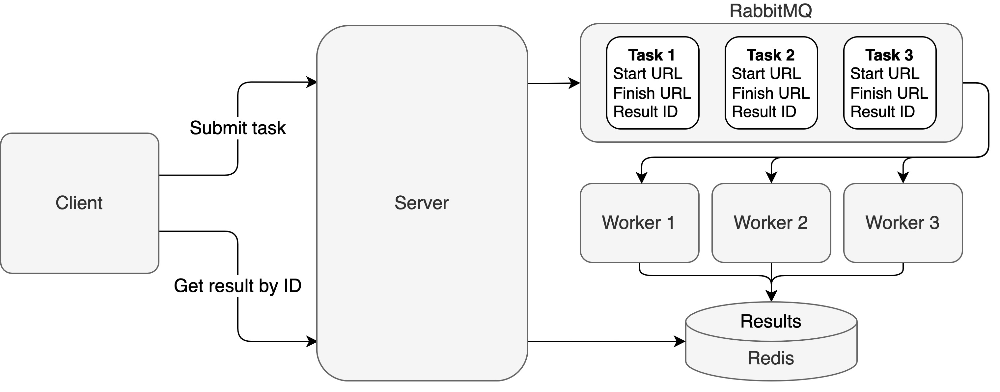

# Wikipedia-pathfinding

Finds the shortest path between two Wikipedia
pages ([six degrees of Wikipedia](https://en.wikipedia.org/wiki/Wikipedia:Six_degrees_of_Wikipedia)).



# Run server-side components

```
docker-compose up --scale worker=3                   
```

# Run client

```
go mod download
go run cmd/client/main.go
```
